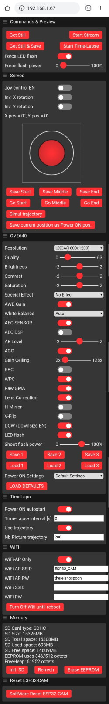

# ESP32-Timelaps
ESP32-Cam TimeLaps project with all options from web interface, and eeprom settings storage.

I used code from bitluni to learn the web interface and prepare the base for future projects : [bitluni/ESP32CamTimeLapse](https://github.com/bitluni/ESP32CamTimeLapse).

## Functions
* Full controlled throught the web interface
* All settings in EEPROM
* 3 sets of settings available to store/load on demand
* AutoStart
* WiFi Station & AP Wifi can be disable while running
* Memory information and management
* SDCard can be initialize while running
* LED Flash is OFF

## Configure
* All parameters from the web interface
* Select/comment camera pinout in `include\pins_camera.h` according to your board
* According to your camera behavior, set the camera frequency in camera.h "config.xclk_freq_hz" to get good images. Mine works at 5MHz.

## Create video from img using W10 Photo
* In Windows Explorer, select all files you want to include in the video
* Right click on selection -> Property -> Details
* Select a random date on the "Origin -> Date taken" property, then apply
* Use native W10 Photo to create video

## Create video from img using fffmpeg
[JackGruber/ESP32-Timelaps-Webcam](https://github.com/JackGruber/ESP32-Timelaps-Webcam)

## To Do
* Add control for the LED Flash
* Add embedded picture rotation
* Add control and command for servos (sun tracking)
* Add camera frequency in settings

## Web interface

## Links
* [Original GitHub repro ESP32CamTimeLapse](https://github.com/bitluni/ESP32CamTimeLapse)
* [Project page from the ESP32CamTimeLapse](https://bitluni.net/esp32camtimelapse)
* [FFmpeg download](https://www.ffmpeg.org/download.html)
* [An other cool TimeLaps project from JackGruber that could better fit your needs](https://github.com/JackGruber/ESP32-Timelaps-Webcam)
